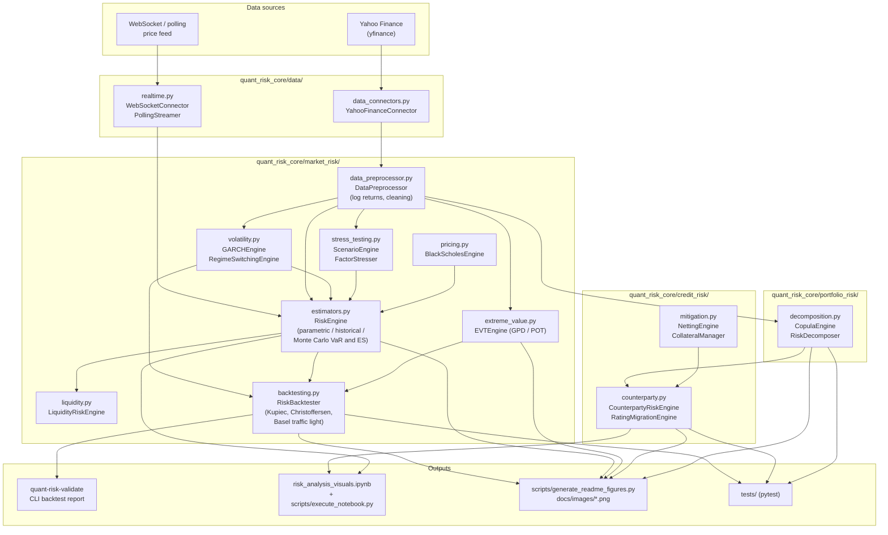

# Quant Risk Core

A modular, tested Python library for quantitative **market**, **credit**, and **portfolio** risk:
GARCH volatility, VaR/ES estimation, extreme value theory, Basel backtesting, counterparty
exposure & CVA, and risk decomposition — plus connectors for historical and streaming market data.

All figures below are generated by the repository's own engines running on real market data
(`python scripts/generate_readme_figures.py`).

---

## Architecture



### Walkthrough

1. **Ingest.** `quant_risk_core.data.data_connectors.YahooFinanceConnector` pulls adjusted historical prices for a
   ticker list; `quant_risk_core.data.realtime` provides a threaded `WebSocketConnector` and a `PollingStreamer`
   for live last-price updates.
2. **Prepare.** `quant_risk_core.market_risk.data_preprocessor.DataPreprocessor` forward-fills gaps, drops
   zero-variance columns, and converts prices to log returns.
3. **Model.** `GARCHEngine` (GARCH/EGARCH/GJR, normal or Student-t via `arch`) produces conditional
   and forecast volatility. It checks optimiser convergence and exposes `converged`,
   `convergence_flag` and `persistence`; a fit that fails to converge still returns plausible-looking
   parameters, so construct with `strict=True` to make that an error rather than a warning.
   `RegimeSwitchingEngine` fits a Markov-switching regression for regime probabilities. `EVTEngine` fits a Generalized Pareto distribution to peaks over a threshold.
   `BlackScholesEngine` prices options and Greeks for the instruments being risked.
4. **Measure.** `RiskEngine` turns those inputs into VaR and Expected Shortfall three ways —
   parametric (normal / Student-t), historical simulation, and vectorised Monte Carlo GBM paths
   (explicitly seeded — every result reports the seed that reproduces it). `LiquidityRiskEngine` adds a bid-ask spread and market-impact overlay; `ScenarioEngine`
   and `FactorStresser` apply historical and hypothetical shocks.
5. **Aggregate.** `quant_risk_core.portfolio_risk.decomposition.RiskDecomposer` splits portfolio VaR into marginal
   and component contributions; `CopulaEngine` generates Gaussian-copula dependent samples for
   multi-asset simulation.
6. **Credit.** Simulated portfolio paths flow into `NettingEngine` and `CollateralManager`
   (threshold, MTA, margin period of risk), then into `CounterpartyRiskEngine` for EE / EPE / PFE
   profiles, CVA, and wrong-way-risk-adjusted CVA. `RatingMigrationEngine` simulates rating paths
   from a transition matrix.
7. **Validate & report.** `RiskBacktester` scores VaR forecasts with the Kupiec POF test, the
   Christoffersen independence test, and the Basel traffic-light zone. `quant-risk-validate` is the
   CLI entry point, `risk_analysis_visuals.ipynb` the interactive report, and
   `scripts/generate_readme_figures.py` produces the figures below.

### Repository layout

Everything importable lives under a single `quant_risk_core` namespace in a `src/` layout. The
packages used to sit at the top level, where `data` and `tests` would have collided with any other
distribution installing those names into the same environment.

| Path | Responsibility |
|------|----------------|
| `src/quant_risk_core/data/` | Market data access. `data_connectors.py` (Yahoo Finance historical prices, metadata, latest price with retry/backoff) and `realtime.py` (websocket + polling streamers). |
| `src/quant_risk_core/market_risk/` | Core market-risk engines: preprocessing, volatility, VaR/ES estimators, EVT, liquidity, option pricing, stress testing, backtesting. |
| `src/quant_risk_core/portfolio_risk/` | Multi-asset aggregation: Gaussian copula sampling and marginal/component VaR decomposition. |
| `src/quant_risk_core/credit_risk/` | Counterparty credit: exposure profiles, CVA (incl. wrong-way risk), rating migration, netting and collateral mitigation. |
| `src/quant_risk_core/cli.py` | The `quant-risk-validate` console script: fits GARCH, rolls a VaR series, prints Kupiec / Christoffersen / Basel metrics. |
| `scripts/` | Repo utilities, not part of the distribution: `execute_notebook.py` (run the notebook headless and export PNG/HTML), `generate_readme_figures.py` (regenerate `docs/images/`), `realtime_demo.py` (streaming demo). |
| `tests/` | pytest suite; `tests/golden/` holds the independently-sourced validation values. |
| `docs/images/` | Generated figures used in this README. |
| `risk_analysis_visuals.ipynb` | Interactive analysis notebook (Plotly). |

---

## Figures

### 1. GARCH conditional VaR and Basel backtest


A GARCH(1,1) model with Student-t innovations is fitted to seven years of SPY log returns. The top
panel overlays the resulting 99% one-day VaR against realised returns, with breaches marked in red;
the bottom panel shows the annualised conditional volatility. The footer reports the fitted
parameters together with the `RiskBacktester` verdict — exception count, Kupiec POF p-value,
Christoffersen independence p-value, and Basel traffic-light zone.

### 2. VaR / ES across estimation methods


The same return series priced by all three `RiskEngine` methods. Left: the empirical loss
distribution with historical 99% VaR and ES. Right: 95% and 99% VaR/ES from parametric normal,
parametric Student-t, historical simulation, and 50,000-path Monte Carlo — showing how much tail
risk a thin-tailed normal assumption misses.

### 3. Extreme value theory (peaks over threshold)


`EVTEngine` fits a Generalized Pareto distribution to losses beyond the 95th percentile. Left: the
fitted GPD against the empirical excess distribution, with the estimated shape and scale. Right:
EVT VaR and ES extrapolated out to the 99.9% level compared with historical simulation, which
cannot see past its worst observed day.

### 4. Counterparty exposure profiles and CVA


A three-trade netting set simulated over a five-year grid at SPY-calibrated volatility. Left:
expected exposure, EPE, and 95% PFE with and without netting, plus the collateralised profile from
`CollateralManager` (threshold, MTA, 10-day margin period of risk). The collateralised profile
plateaus just above the threshold rather than falling to zero — that residual is the exposure the
margin period of risk leaves uncovered. The grid step is set to 10 business days so the MPOR is
representable as exactly one step; on a coarser grid it cannot be expressed at all. Right: the
resulting CVA under each mitigation regime, discounted at 3%, including the wrong-way-risk
multiplier.

### 5. Portfolio risk decomposition


An equal-weighted five-asset book decomposed by `RiskDecomposer`: component VaR contributions sum
exactly to portfolio VaR, so the chart shows where the risk actually sits rather than where the
capital does. The correlation matrix on the right is the dependence structure fed to `CopulaEngine`.

---

## Installation

```bash
git clone https://github.com/thompgt/quant-risk-core.git
cd quant-risk-core
python -m venv .venv && source .venv/bin/activate   # Windows: .venv\Scripts\activate
pip install -e ".[data,viz,notebook,dev]" -c constraints.txt
```

`pyproject.toml` declares the version *range* the library is supported on; `constraints.txt` pins
one exact, known-good point inside it. Drop the `-c` flag to resolve freely, keep it to reproduce
the stack the tests were last verified against — a risk number you cannot reproduce cannot be
validated, and that includes the versions that produced it.

Python 3.12+ required (developed on 3.13). The core install pulls only the analytics stack
(numpy, scipy, pandas, arch, statsmodels); the extras are separable:

| Extra | Brings in | Needed for |
|-------|-----------|------------|
| `data` | yfinance, websocket-client | `quant_risk_core.data` — historical and streaming prices |
| `viz` | matplotlib, plotly, kaleido | the figure scripts and the notebook's charts |
| `notebook` | ipykernel, nbformat, nbconvert, ipywidgets | `risk_analysis_visuals.ipynb` |
| `dev` | pytest, pytest-cov, hypothesis, ruff, mypy | running the test suite and the linters |

The `src/` layout means the package must be installed (editable is fine) before the tests can
import it — that is deliberate, so the suite exercises the installed distribution rather than the
working directory.

## Usage

Run the VaR backtest validation report:

```bash
quant-risk-validate
```

Regenerate the README figures (fetches live market data):

```bash
python scripts/generate_readme_figures.py
```

Execute the analysis notebook headless and export PNG/HTML:

```bash
python scripts/execute_notebook.py
```

Real-time price streaming demo:

```bash
python -m scripts.realtime_demo
```

Run the test suite:

```bash
python -m pytest -q
```

### Library example

```python
import pandas as pd

from quant_risk_core.data.data_connectors import YahooFinanceConnector
from quant_risk_core.market_risk.data_preprocessor import DataPreprocessor
from quant_risk_core.market_risk.volatility import GARCHEngine
from quant_risk_core.market_risk.estimators import RiskEngine
from quant_risk_core.market_risk.backtesting import RiskBacktester

prices = YahooFinanceConnector.fetch_historical_prices(["SPY"], "2018-01-01", "2024-12-31")
returns = DataPreprocessor().compute_log_returns(prices)["SPY"].dropna()

garch = GARCHEngine(p=1, q=1, dist="t")
garch.fit(returns)
vol = garch.conditional_volatility()

engine = RiskEngine(confidence_levels=[0.99])
var = [engine.parametric_var_es(0.0, s, dist="t", df=garch.nu)["VaR_0.99"] for s in vol]

print(RiskBacktester(confidence_level=0.99).evaluate(returns, pd.Series(var, index=returns.index)))
```

## Testing

```bash
python -m pytest -q
```

`tests/golden/` holds validation tests whose expected values come from sources independent of the
implementation (numerical quadrature, published references), rather than from the library's own
output. Each golden test cites its reference in the module docstring.
